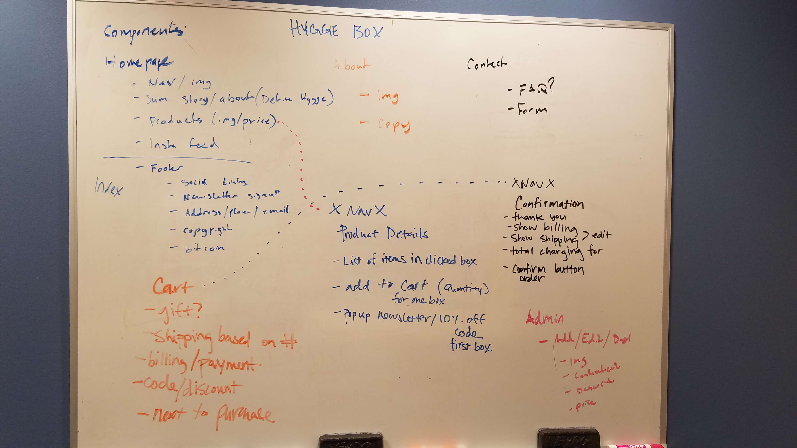

# _HyggeBox_

#### _A group project exploring Angular and Google Firebase, 11.09.2017_

This project was generated with [Angular CLI](https://github.com/angular/angular-cli) version 1.0.0.

#### By _Dawson Mortenson, Sara Spink, Karla Buckner, and Riki Montgomery_

### Description

_HyggeBox is a storefront application to provide thoughtfully-curated boxes that celebrate the simple pleasures of life. Sourced from the Pacific Northwest and beyond and come packaged in locally-made, eco-conscious boxes. We specialize in gifts that reflect our sense of adventure and our constant pursuit of coziness._

_HyggeBox is an application to provide thoughtfully-curated boxes that celebrate the simple pleasures of life. Our monthly collections are sourced from the Pacific Northwest and beyond and come packaged in locally-made, eco-conscious boxes. We specialize in gifts that reflect our sense of adventure and our constant pursuit of coziness. Each of our boxes is designed to provide a personal retreat of balance and equipoise in today’s chaotic environment._

### User Stories

* Users should be able to find us on social media (instagram, pinterest, facebook, twitter).
* Users should be able to fill out a form to contact our customer support team for questions about their service.
* Users should be able to see their shopping cart, including an order summary and form fields to make a purchase.
* Users should be able to see a detailed view of each product.
* Users should be able to ship a subscription as a gift.
* Users should be able to purchase a one-time, 6 month, or 1 year subscription.
* Users should be able to create an account and login using the Google authentication service.

### Further Exploration

* Users should be able to share or pin our photos.
* Admins should be able to add, edit, and delete products.
* Users should be able to send a gift with a custom note.
* Admins should be able to remove customers from the newsletter list.
* Admins should be able to add or remove customer accounts.
* Users should be able to see their orders on their account, including the date of their next subscription shipment.
* Users should trigger an email confirmation when they make a purchase.
* Users should be able to sign up for our newsletter with their name and email address.
* Add Firebase & Sendgrid Web API v3 Autoresponder for custom autogenerated emails on submit (purchase confirmation)

### Technologies Used

* HTML
* CSS
* Bootstrap
* JavaScript
* Node
* Angular 2
* Typescript
* Google Firebase

### Database Requirements

1. _Sign up for [Google Firebase](https://firebase.google.com/). Start a new project and generate an API key._

2. _Run `$ git clone` [https://github.com/mostriki/hygge-box](https://github.com/mostriki/hygge-box) in your Desktop to download the project directory locally._

3. _Run `$ cd hygge-box/` to change from your Desktop to the HyggeBox directory._

4. _Run `$ touch src/app/api-keys.ts` to create a new file called `api-keys.ts`._

5. _Add your Firebase API key to `api-keys.ts`. It should look like this:_

` export const masterFirebaseConfig = {
  apiKey: "XXXXXXXXXXXXXXXXXXX",
  authDomain: "XXXX.firebaseapp.com",
  databaseURL: "https://XXXXXXXX.firebaseio.com",
  projectId: "XXXX",
  storageBucket: "XXXX.appspot.com",
  messagingSenderId: "XXXXXXXXXXX"
};
firebase.initializeApp(config);`

6. _Run `$ npm install` to install the node dependencies._

7. _Run `$ ng serve` for a development server. Navigate to [http://localhost:4200/](http://localhost:4200/). The app will automatically reload if you change any of the source files._

### Further help

_To get more help on the Angular CLI use `ng help` or go check out the [Angular CLI README](https://github.com/angular/angular-cli/blob/master/README.md)._

### Support and contact details

_If you have any updates or suggestions please make a contribution to my repository or  contact [Riki](mostriki820@gmail.com), [Karla](), [Dawson](), and [Sara]() directly._

### License

_© 2017 HyggeBox_
